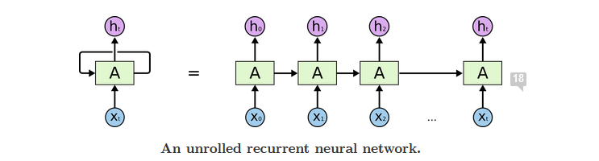

# Portfolio: Data Science 
---
## Market Basket Association Prediction [Apriori Algorithm using R and WEKA]

Machine-learning project using association rule mining to find associative patterns from market-basket data.  The Apriori algorithm was chosen.  By learning buying patterns, companies can improve catalogue content, effectively complete store layout, and find fraud in various transactions (credit-card, network-intrusion). This project used a grocery data set.

**Outcome (Image Below):** The result indicates that “other vegetable” items purchased by a customer will lead to (more than other purchased items) the purchase of the item “whole milk”.  

**Business Impact:**  We can collocate higher priced veggies (a stand of Organics) near milk section, or implement incentive purchase offer programs by the grocer. 

  "A Work in Process"

**Apriori Algorithm:** Uses frequent itemsets to generate association rules. It is based on the concept that a subset of a frequent itemset must also be a frequent itemset. 

**Association Rule Mining:** A Data Mining technique that finds patterns in data. The patterns found by Association Rule Mining represent relationships between items. When this is used with sales data, it is referred to as **Market Basket Analysis**.

---
## Sentiment Analysis of Film Reviews [Recurrent Neural Network using Python, TensorFlow & Keras]

  
   
 

Recommender Systems are used to predict items that a user will select among many choices. Recommender systems are used in a variety of areas, with commonly recognised examples taking the form of playlist generators for video and music services, product recommenders for online stores, or content recommenders for social media platforms and open web content recommenders.

  "A Work in Process"

**Movie Predictions:** I used a movide data set from IMDB, which is an embedded Keras dataset.  I trained an RNN to classify if a written movie review was positive or negative. 

**The Magic:** I am using an Recurrent Neural Network, which will be trained how to "read" movie reviews and guess whether the author liked the movie or not. And this was completed by creating a sentiment classification from the first 80 words of a movie review. 

**Recurrent Nueral Networks:** RNN's are very powerful tools for wide variety of problems, used for sequences of data, including languages (which are sequences of words).  As it turns out, **Deep Learning** is especially suitable to predicting sequences of events, like which videos you're likely to watch next.  So this has applications and recommender systems that deal with situations where the order of events matters.

